This page contains an open multimodal vehicle dataset described in the "Towards Collecting Large-Scale Vehicular Sensor Data for Open Access" paper, published in the 12th International Workshop on Autonomous Systems and Software Architecture (WASA) 2026. The data is free to be used under the Creative Commons CC BY 4.0 [license](https://creativecommons.org/licenses/by/4.0/deed.en). When using the data, you must give an attribution to the following paper and provide a link to the dataset:

_B. Kämä, O. Timonen, N. Stafford, J. Lotvonen, O. Kalliokoski, A. Kanerva, P. Rathnayake, S. Gamage, A. Vuorinen, S. Ariram, E. Gilman & E. Peltonen.
Towards Collecting Large-Scale Vehicular Sensor Data for Open Access. IEEE 23rd International Conference on Software Architecture Companion (ICSA-C). Amsterdam, Netherlands. 2026_

[Link to the preprint](https://www.researchgate.net/publication/406808081_Towards_Collecting_Large-Scale_Vehicular_Sensor_Data_for_Open_Access)

For further enqueries and questions about the data or paper, please contact benjamin.kama or ella.peltonen at oulu.fi

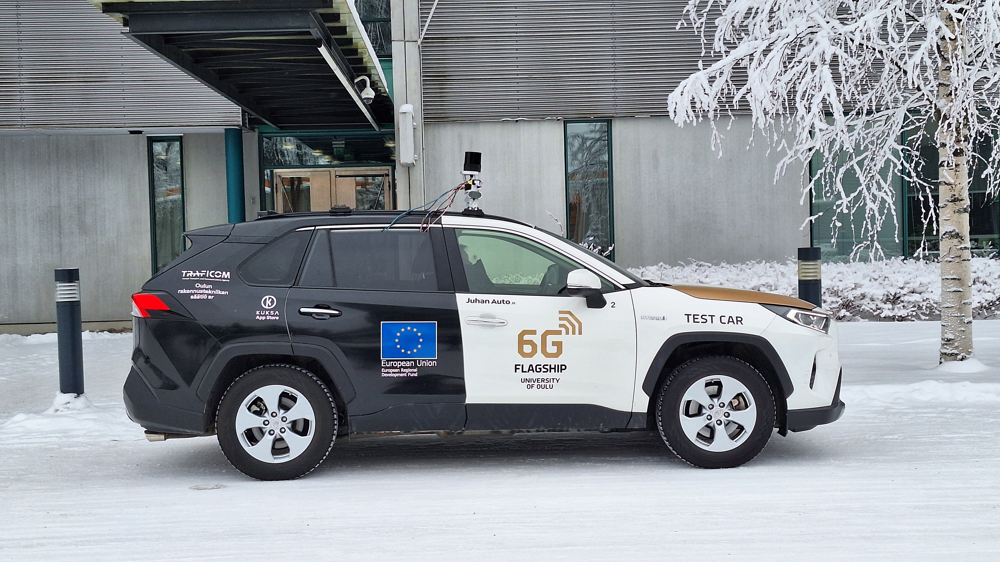

## How the Dataset was Collected

The dataset was collected by driving in urban areas of Oulu, Finland while having sensors installed on the roof of the car. Sensor data was collected and recorded via ROS2 on on-board computer. Recorded data includes stereo camera images, thermal camera images, lidar pointcloud, plus the car's CAN bus data and GPS information.

### Route and environmental specifics

Three separate people drove through the same route in Oulu on a sunny day in June. The city part includes cobblestones, traffic lights, parked vehicles, and pedestrians. The highway route begins with merging onto the highway, and then sustaining 80-100km/h speed.

| City route                                                   | Highway route                                                   |
| ------------------------------------------------------------ | --------------------------------------------------------------- |
| 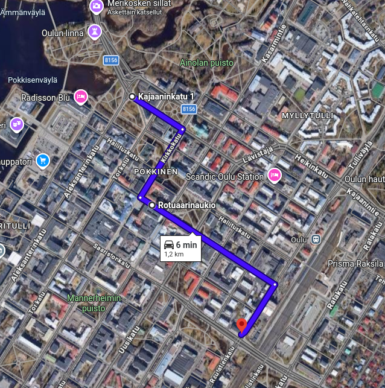                       | 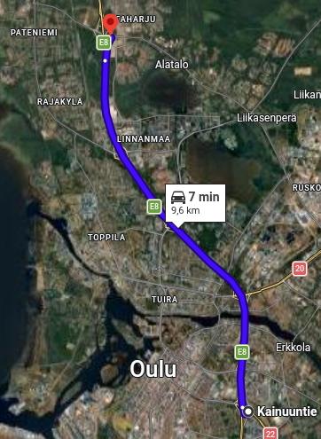                    |
| [City route link](https://maps.app.goo.gl/3UnANSPNsRBDGEDu9) | [Highway route link](https://maps.app.goo.gl/GxyeRvVVPpaBBWdR6) |

### Computer and software setup

The computer inside the car is a [NVIDIA Jetson AGX Orin Developer Kit](https://www.nvidia.com/en-us/autonomous-machines/embedded-systems/jetson-orin/) on Ubuntu 22.04 running ROS2 nodes in Docker containers. The nodes include sensor drivers, and a recorder to write the messages on an SSD in the form of [.mcap](https://mcap.dev/) files. [The source code for our setup is publicly available on github](https://github.com/M3S-Kuura/ros2-device-control).

### Car and sensor setup

The car used was a Toyota RAV4 Hybrid 2019.

Thermal cameras: [FLIR ADK 2.0 LWIR](https://oem.flir.com/en-150/products/adk/?segment=oem&vertical=automotive)

Stereo camera: [Carnegie Robotics Multisense S27](https://www.carnegierobotics.com/multisense-s27)

Lidar: [Hesai OT128 Lidar](https://www.hesaitech.com/product/ot128/)

GPS: [PCAN-GPS](https://www.peak-system.com/products/hardware/i-o-modules/pcan-gps/?L=1).

Recording settings for Lidar:

- Standard resolution
- Single-point first return
- 600 RPM

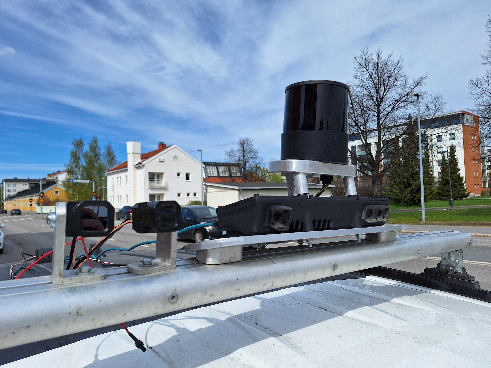

## Data format

The dataset has people's faces and vehicle license plates blurred to respect people's privacy. Hence the dataset does not contain the original .mcap files which would include unblurred images.

| Data source                  | Description                                     | Original format             | Dataset format       | Target frequency |
| ---------------------------- | ----------------------------------------------- | --------------------------- | -------------------- | ---------------- |
| /lidar_points ROS2 topic     | LiDAR                                           | PointCloud2 (230400 points) | .laz                 | 10hz             |
| /image_raw ROS2 topic        | Thermal cameras                                 | mono16                      | 8-bit colormap .png  | 60hz             |
| /aux/image_color ROS2 topic  | Stereo camera's middle camera                   | bgr8                        | 8-bit rgb .png       | 25hz             |
| /left/image_rect ROS2 topic  | Stereo camera's left camera                     | mono8                       | 8-bit grayscale .png | 25hz             |
| /right/image_rect ROS2 topic | Stereo camera's right camera                    | mono8                       | 8-bit grayscale .png | 25hz             |
| /left/depth ROS2 topic       | Stereo camera's estimated depth distance        | 32FC1                       | 8-bit colormap .png  | 25hz             |
| /left/cost ROS2 topic        | Stereo camera's confidence value of /left/depth | mono8                       | 8-bit grayscale .png | 25hz             |
| Car CAN bus                  | Car sensor messages                             | Hexadecimal bytes           | Human-readable .json | --               |
| PCAN-GPS                     | GPS sensor messages                             | Hexadecimal bytes           | Human-readable .json | --               |

CAN and GPS frequencies are over 700 messages per second, however they have no "target" frequency. There are no messages lost in them, but unknown CAN signals are excluded out of this dataset. 100% of GPS signals are converted and included in this dataset. CAN bus is read and translated into known signals using .dbc file generated by [opendbc](https://github.com/commaai/opendbc) software. No proprietary information was published when sharing the decoded signals and no NDA was broken. The generated dbc file had 43 message definitions.

## Data examples

The following sample of data is from the dataset.

### Stereo camera

/aux/image_color:

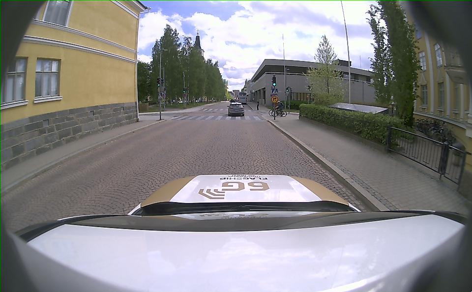

| /left/image_rect                                         | /right/image_rect                                          |
| -------------------------------------------------------- | ---------------------------------------------------------- |
| 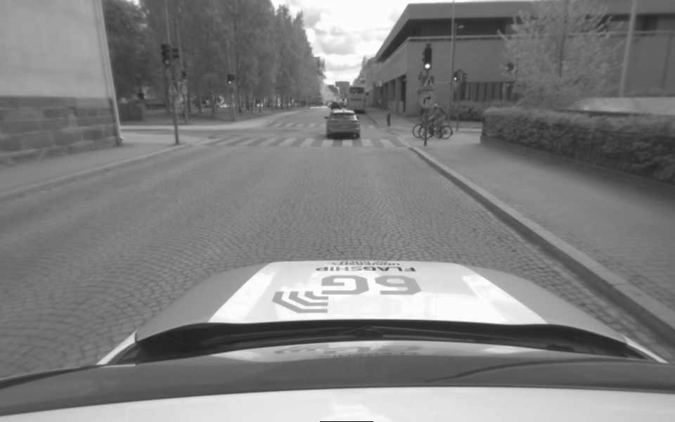 | 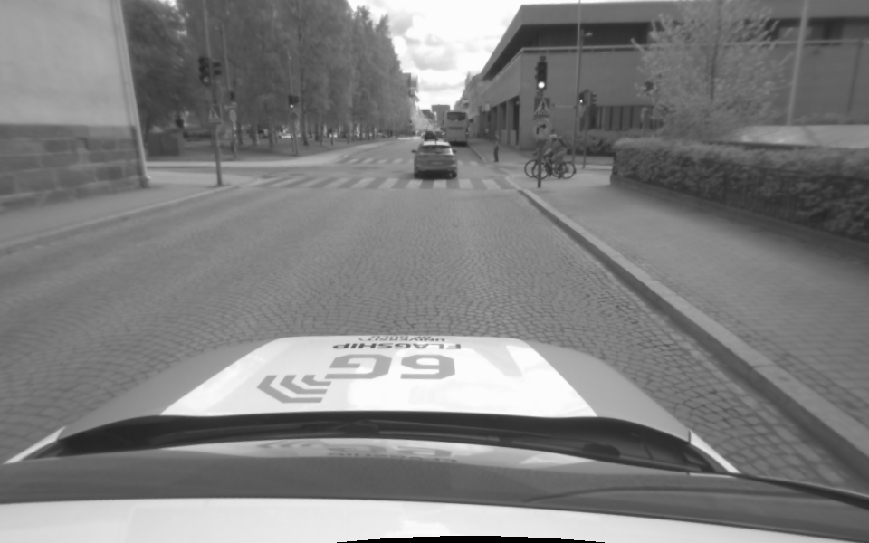 |

/left/depth:

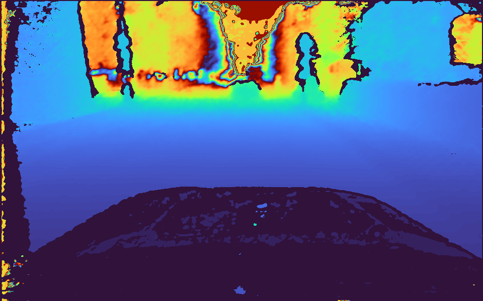

/left/cost:

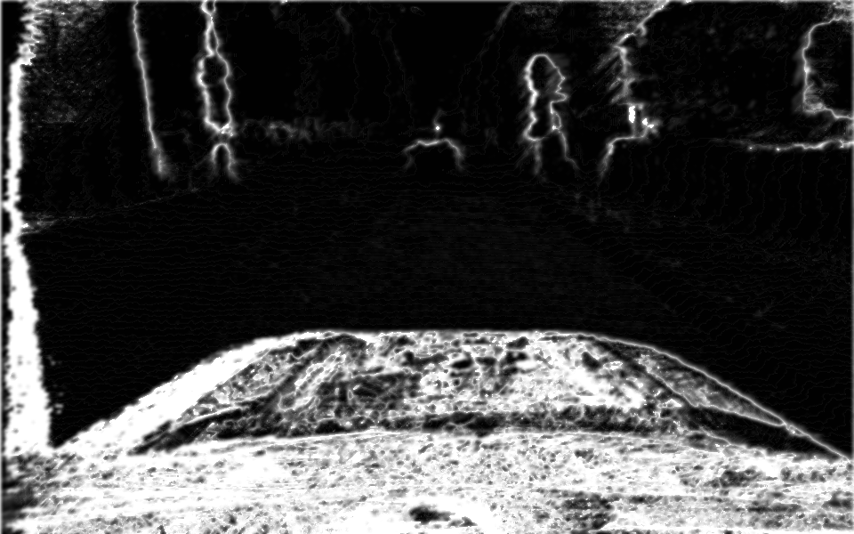

### Thermal camera

| /flir_0/image_raw                               | /flir_1/image_raw                                |
| ----------------------------------------------- | ------------------------------------------------ |
| 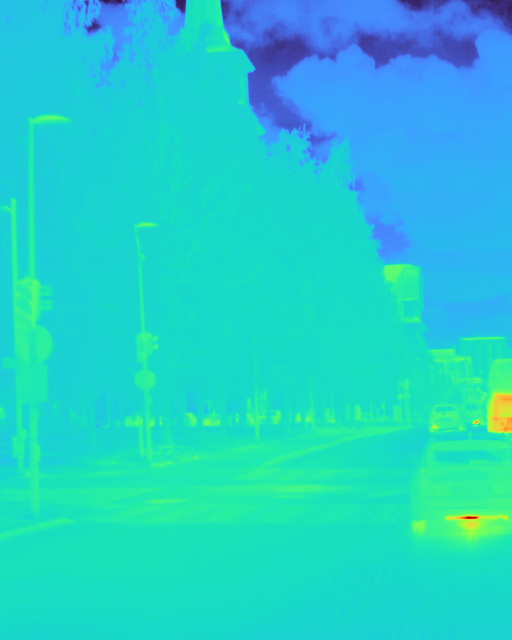 | 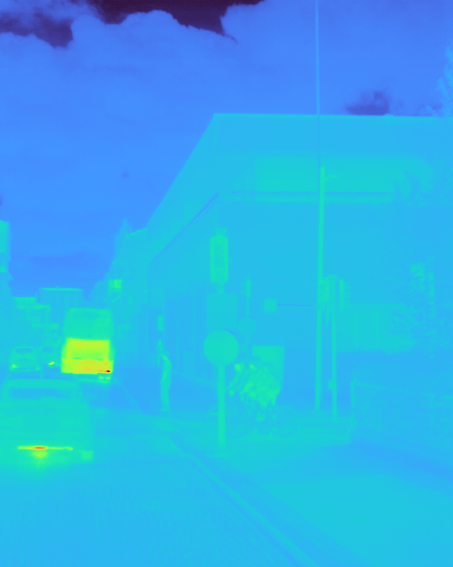 |

### Lidar

/lidar_points:

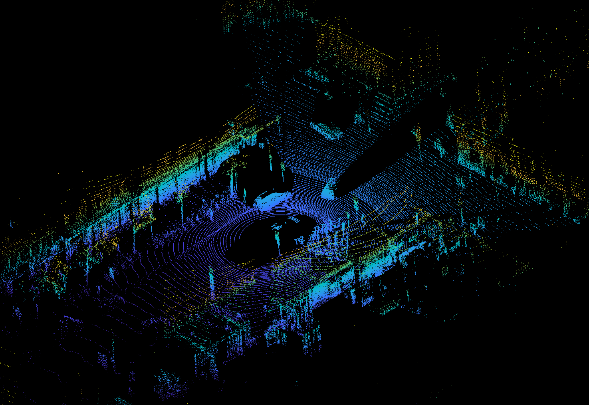

CAN bus .json:

```json
    {
        "timestamp": 1780480412.007036,
        "frame_id": "0x1D3",
        "message": "PCM_CRUISE_2",
        "signal": "CHECKSUM",
        "value": 4
    },
    {
        "timestamp": 1780480412.007036,
        "frame_id": "0xB4",
        "message": "SPEED",
        "signal": "ENCODER",
        "value": 45
    },
    {
        "timestamp": 1780480412.007036,
        "frame_id": "0xB4",
        "message": "SPEED",
        "signal": "SPEED",
        "value": 28.18
    },
```

### CAN bus and GPS

GPS .json:

```json
    {
        "timestamp": 1780480412.039233,
        "frame_id": "0x601",
        "message": "BMC_MagneticField",
        "signal": "MagneticField_X",
        "value": -71.7
    },
    {
        "timestamp": 1780480412.039233,
        "frame_id": "0x601",
        "message": "BMC_MagneticField",
        "signal": "MagneticField_Y",
        "value": 41.699999999999996
    },
    {
        "timestamp": 1780480412.039233,
        "frame_id": "0x601",
        "message": "BMC_MagneticField",
        "signal": "MagneticField_Z",
        "value": -66.3
    },
```

Timestamps of all files are included in the file name in [Unix time format](https://en.wikipedia.org/wiki/Unix_time).

## Download links



| Size estimation | Download link                                                                | Data source        |
| --------------- | ---------------------------------------------------------------------------- | ------------------ |
| 5 GB            | [/aux/image_color](https://a3s.fi/swift/v1/wasa1/city/aux_image_color.tar)   | Stereo camera  |
| 3 GB            | [/left/image_rect](https://a3s.fi/swift/v1/wasa1/city/left_image_rect.tar)   | Stereo camera  |
| 3 GB            | [/right/image_rect](https://a3s.fi/swift/v1/wasa1/city/right_image_rect.tar) | Stereo camera  |
| 2 GB            | [/left/depth](https://a3s.fi/swift/v1/wasa1/city/left_depth.tar)             | Stereo camera  |
| 2 GB            | [/left/cost](https://a3s.fi/swift/v1/wasa1/city/left_cost.tar)               | Stereo camera  |
| 3 GB            | [/lidar_points](https://a3s.fi/swift/v1/wasa1/city/lidar_points.tar)         | Lidar              |
| 7 GB            | [/flir_0/image_raw](https://a3s.fi/swift/v1/wasa1/city/flir_0_image_raw.tar) | Thermal camera     |
| 7 GB            | [/flir_1/image_raw](https://a3s.fi/swift/v1/wasa1/city/flir_1_image_raw.tar) | Thermal camera     |
| 67 MB           | [Car CAN bus & GPS](https://a3s.fi/swift/v1/wasa1/city/can.tar)              | CAN bus & PCAN-GPS |





| Size estimation | Download link                                                                | Data source        |
| --------------- | ---------------------------------------------------------------------------- | ------------------ |
| 5 GB            | [/aux/image_color](https://a3s.fi/swift/v1/wasa2/city/aux_image_color.tar)   | Stereo camera  |
| 3 GB            | [/left/image_rect](https://a3s.fi/swift/v1/wasa2/city/left_image_rect.tar)   | Stereo camera  |
| 3 GB            | [/right/image_rect](https://a3s.fi/swift/v1/wasa2/city/right_image_rect.tar) | Stereo camera  |
| 2 GB            | [/left/depth](https://a3s.fi/swift/v1/wasa2/city/left_depth.tar)             | Stereo camera  |
| 2 GB            | [/left/cost](https://a3s.fi/swift/v1/wasa2/city/left_cost.tar)               | Stereo camera  |
| 3 GB            | [/lidar_points](https://a3s.fi/swift/v1/wasa2/city/lidar_points.tar)         | Lidar              |
| 7 GB            | [/flir_0/image_raw](https://a3s.fi/swift/v1/wasa2/city/flir_0_image_raw.tar) | Thermal camera     |
| 7 GB            | [/flir_1/image_raw](https://a3s.fi/swift/v1/wasa2/city/flir_1_image_raw.tar) | Thermal camera     |
| 67 MB           | [Car CAN bus & GPS](https://a3s.fi/swift/v1/wasa2/city/can.tar)              | CAN bus & PCAN-GPS |





| Size estimation | Download link                                                                | Data source        |
| --------------- | ---------------------------------------------------------------------------- | ------------------ |
| 5 GB            | [/aux/image_color](https://a3s.fi/swift/v1/wasa3/city/aux_image_color.tar)   | Stereo camera  |
| 3 GB            | [/left/image_rect](https://a3s.fi/swift/v1/wasa3/city/left_image_rect.tar)   | Stereo camera  |
| 3 GB            | [/right/image_rect](https://a3s.fi/swift/v1/wasa3/city/right_image_rect.tar) | Stereo camera  |
| 2 GB            | [/left/depth](https://a3s.fi/swift/v1/wasa3/city/left_depth.tar)             | Stereo camera  |
| 2 GB            | [/left/cost](https://a3s.fi/swift/v1/wasa3/city/left_cost.tar)               | Stereo camera  |
| 3 GB            | [/lidar_points](https://a3s.fi/swift/v1/wasa3/city/lidar_points.tar)         | Lidar              |
| 7 GB            | [/flir_0/image_raw](https://a3s.fi/swift/v1/wasa3/city/flir_0_image_raw.tar) | Thermal camera     |
| 7 GB            | [/flir_1/image_raw](https://a3s.fi/swift/v1/wasa3/city/flir_1_image_raw.tar) | Thermal camera     |
| 67 MB           | [Car CAN bus & GPS](https://a3s.fi/swift/v1/wasa3/city/can.tar)              | CAN bus & PCAN-GPS |





| Size estimation | Download link                                                                   | Data source        |
| --------------- | ------------------------------------------------------------------------------- | ------------------ |
| 5 GB            | [/aux/image_color](https://a3s.fi/swift/v1/wasa1/highway/aux_image_color.tar)   | Stereo camera  |
| 3 GB            | [/left/image_rect](https://a3s.fi/swift/v1/wasa1/highway/left_image_rect.tar)   | Stereo camera  |
| 3 GB            | [/right/image_rect](https://a3s.fi/swift/v1/wasa1/highway/right_image_rect.tar) | Stereo camera  |
| 2 GB            | [/left/depth](https://a3s.fi/swift/v1/wasa1/highway/left_depth.tar)             | Stereo camera  |
| 2 GB            | [/left/cost](https://a3s.fi/swift/v1/wasa1/highway/left_cost.tar)               | Stereo camera  |
| 3 GB            | [/lidar_points](https://a3s.fi/swift/v1/wasa1/highway/lidar_points.tar)         | Lidar              |
| 7 GB            | [/flir_0/image_raw](https://a3s.fi/swift/v1/wasa1/highway/flir_0_image_raw.tar) | Thermal camera     |
| 7 GB            | [/flir_1/image_raw](https://a3s.fi/swift/v1/wasa1/highway/flir_1_image_raw.tar) | Thermal camera     |
| 67 MB           | [Car CAN bus & GPS](https://a3s.fi/swift/v1/wasa1/highway/can.tar)              | CAN bus & PCAN-GPS |





| Size estimation | Download link                                                                   | Data source        |
| --------------- | ------------------------------------------------------------------------------- | ------------------ |
| 5 GB            | [/aux/image_color](https://a3s.fi/swift/v1/wasa2/highway/aux_image_color.tar)   | Stereo camera  |
| 3 GB            | [/left/image_rect](https://a3s.fi/swift/v1/wasa2/highway/left_image_rect.tar)   | Stereo camera  |
| 3 GB            | [/right/image_rect](https://a3s.fi/swift/v1/wasa2/highway/right_image_rect.tar) | Stereo camera  |
| 2 GB            | [/left/depth](https://a3s.fi/swift/v1/wasa2/highway/left_depth.tar)             | Stereo camera  |
| 2 GB            | [/left/cost](https://a3s.fi/swift/v1/wasa2/highway/left_cost.tar)               | Stereo camera  |
| 3 GB            | [/lidar_points](https://a3s.fi/swift/v1/wasa2/highway/lidar_points.tar)         | Lidar              |
| 7 GB            | [/flir_0/image_raw](https://a3s.fi/swift/v1/wasa2/highway/flir_0_image_raw.tar) | Thermal camera     |
| 7 GB            | [/flir_1/image_raw](https://a3s.fi/swift/v1/wasa2/highway/flir_1_image_raw.tar) | Thermal camera     |
| 67 MB           | [Car CAN bus & GPS](https://a3s.fi/swift/v1/wasa2/highway/can.tar)              | CAN bus & PCAN-GPS |





| Size estimation | Download link                                                                   | Data source        |
| --------------- | ------------------------------------------------------------------------------- | ------------------ |
| 5 GB            | [/aux/image_color](https://a3s.fi/swift/v1/wasa3/highway/aux_image_color.tar)   | Stereo camera  |
| 3 GB            | [/left/image_rect](https://a3s.fi/swift/v1/wasa3/highway/left_image_rect.tar)   | Stereo camera  |
| 3 GB            | [/right/image_rect](https://a3s.fi/swift/v1/wasa3/highway/right_image_rect.tar) | Stereo camera  |
| 2 GB            | [/left/depth](https://a3s.fi/swift/v1/wasa3/highway/left_depth.tar)             | Stereo camera  |
| 2 GB            | [/left/cost](https://a3s.fi/swift/v1/wasa3/highway/left_cost.tar)               | Stereo camera  |
| 3 GB            | [/lidar_points](https://a3s.fi/swift/v1/wasa3/highway/lidar_points.tar)         | Lidar              |
| 7 GB            | [/flir_0/image_raw](https://a3s.fi/swift/v1/wasa3/highway/flir_0_image_raw.tar) | Thermal camera     |
| 7 GB            | [/flir_1/image_raw](https://a3s.fi/swift/v1/wasa3/highway/flir_1_image_raw.tar) | Thermal camera     |
| 67 MB           | [Car CAN bus & GPS](https://a3s.fi/swift/v1/wasa3/highway/can.tar)              | CAN bus & PCAN-GPS |



---

Files are stored in a .tar archive file. Most compression utilities such as WinRAR can extract them. On Linux, run the following on the command line:

```bash
tar -xvf <file_name>.tar
```

For example:

```bash
tar -xvf aux_image_color.tar
```
